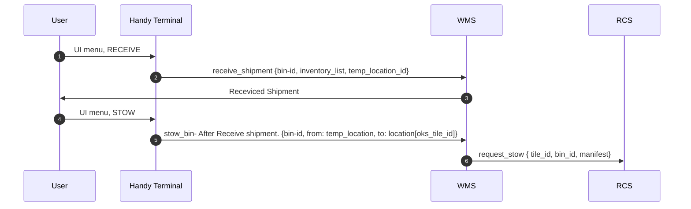

---
category:
- Engineering
coverImage: "https://www.epsglobal.com/getattachment/20c59b9b-abe3-4375-8210-366f6d8e9a7a/Containers,-Docker-and-Kubernetes-A-beginner-s-guide-Part-2.jpg?maxsidesize=780&width=780"
tags:
- 
- topic/platform-engineering
- topic/devops
title: Test Page
---

# Test Page

## Introduction

In today's rapidly evolving software development landscape, staying ahead of the curve is crucial for success. One emerging trend that has gained significant traction is the adoption of Internal Developer Portals (iDp).

In this introductory blog post, we will explore the concept of iDp, its growing popularity in 2023, and why it is essential for modern software development.

#### Image Embed


#### Code Embed

``` python
import os
import json

print(json.load("a,txt"))
```

#### Mermaid Embed



#### Excalidraw embed


/exca
\### Diagram as Code

[Diagram as Code - by Alex Xu - ByteByteGo Newsletter](https://blog.bytebytego.com/p/diagram-as-code)


