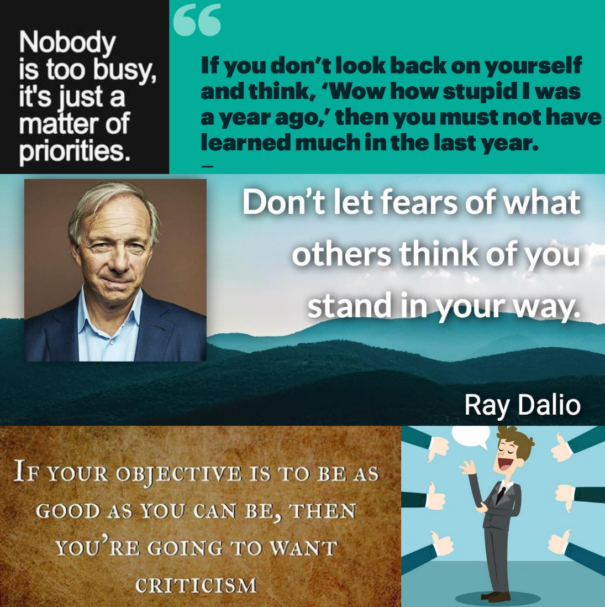

# Story Untold is a Story Lost

Have you ever felt that you aren't valued in this world. Do you feel people dont
"see" you? Have you asked yourself the question, do you tell your story?

<!-- more -->

There is a theme which I have been hammering home for a few years. Something
which I believe I haven't done enough over the decade and something I would do
differenty if we could wind back the sands of time.

Please share your story. I repeat, share your story with the world.

Share it when no one's reading. If nothing, you can revisit your own thoughts in
the future.

Share it when you don't feel like you have the authority to write about a topic.
Imposter syndrome is a thing. Dont be limited by it. Share your thoughts and let
the world correct you.

Share it when you are learning something new. The path you follow would lay the
learning path for another internet strager.

Share it when you are down and out. Let people know what knocked you down. Your
story may be a ray of light for someone looking for hope.

Share it when you are on top of the world. Be specially careful when you do
this. Remember survivorship bias. Be humble and try to share what you did, which
helped you win, without being smug.

## What makes writing difficult

Why don't we write and share our stories?

I have met a bunch of people who are doing amazing work, and don't share. When I
ask them, hey why don't you share your learnings? Their responses are usually
one of the following.

-   Who has the time? Doers prefer doing. Writing is a reflective task. Writing
    becomes a burden and an afterthought. Remember you want to write as a
    habbit. Just like you want to exercise often, you want to write often.
-   Who wants to hear my story? A classic impostor syndrome problem. Well no one
    wants to listen to you, still write. Remember you aren't writing for
    external validation. You are writing for internal reflection.
-   Well, I am afraid people will rip my writing apart, its so bad. Well, write
    still. It will help you deal with criticism and build a thick skin.
-   Well, I don't have many opinions. Interesting problem, but what's a human
    who doesn't believe in something or stand for something. Form opinions while
    writing whatever you know. Trust me, when pen meets paper, words form
    thoughts which help you form your own opinion.

## Building a sharing habbit.

1. Write at a regular cadence. Write unfiltered every other day. Edit once a
   week.
2. Maintain a journal. Programmers journal is an absolute must for engineers on
   my team. Not for the team, but for you, my engineer. I want you to journal
   your journey.
3. Don't obsess over the process and tools. Keep it simple stupid. Just write.
   My recommendation, stick to text, maybe markdown. I know some well organized
   stalwarts who use nothing but Apple Notes to run multi million dollar
   enterprises. Being organized is rarely every about the tools but mostly about
   your discipline.
4. Don't obsess over editing what you write. Just publish. Perfection is a
   fleeting target and will be the end of your authenticity
5. Overcome your stage fear. Fear is the mind killer. What's the worst that can
   happen. People will hate your writing? Let me in on a secret. People aren't
   villians in your story and 9 out of 10 times, they don't care much. Not
   because they are bad people. They just don't have the time away from their
   own bubble.
6. Lastly, be authentic. There is a world of advise which confuses telling your
   story, with building a PR brand. Both look similar on the outside. But they
   serve a different end. Infact, some of the suggestions listed above, may or
   maynot be correct when you building a brand.

## Writing for posterity

Remember you aren't writing to be popular. Writing and sharing is a human need.
You are leaving footprints on sand. It's gonna fade away, but you still leave
your mark.

## References

A great talk which reinforces what I am saying here. This TED talk called "The
Power of Telling Your Story" is a must watch. This presentation is much more
charismatic than my drab bullet point post.

<iframe width="560" height="315" src="https://www.youtube.com/embed/NqCsc31xg24?si=ailX0sldAjlVw1Gr" title="YouTube video player" frameborder="0" allow="accelerometer; autoplay; clipboard-write; encrypted-media; gyroscope; picture-in-picture; web-share" referrerpolicy="strict-origin-when-cross-origin" allowfullscreen></iframe>

 
 

If you have made up your mind about writing and yet are looking for your voice
and style? Paul Graham's essay on writing is a must read.

-   [Putting Ideas Into words](https://paulgraham.com/words.html)
-   [Writing, Briefly](https://paulgraham.com/writing44.html)
-   [Write Simply](https://paulgraham.com/simply.html)
-   [How to Write Usefully](https://paulgraham.com/useful.html)
-   [Writing and Speaking](https://paulgraham.com/speak.html)

## Final Word

If you get inspired and take on writing, congratulations. If you took a step
further and started sharing your story, I amproud of you. Share your writing
with me, I would be happy to read your thoughts and learn from you. Send me the
link [@wiresurfer](https://x.com/wiresurfer) on twitter.
