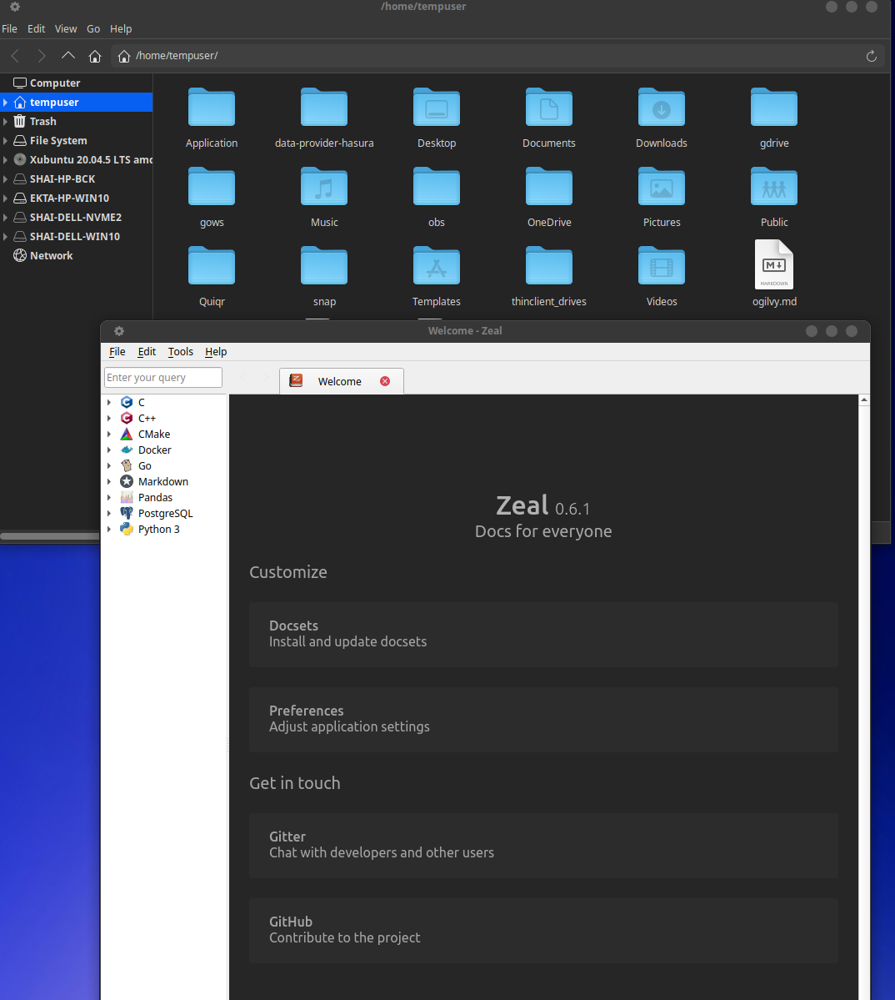
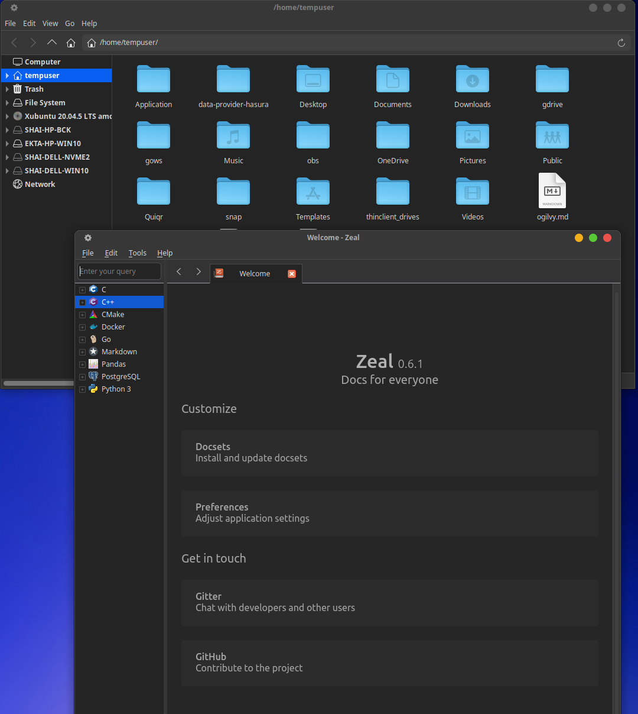

# Tech Tip - Getting QT5 to respect system wide dark mode and GTK theme

It seems my quest for a low overhead xubuntu desktop comes with its fair share
of small annoying little gremlins. Today we talk about how QT5 and Ubuntu
sometimes don't play nice specially when it comes to respecting dark mode
themes. I will go throuh my motivations to use xubutu, or rather any operating
system image for that matter.

<!-- more -->

The problem in this specific case, which triggered this precipitation of words,
and finally some insights into themes, dark mode, desktop window managers and
the lot in linux distrubutions.

\(Nix\) I will get to you

## What's this about?

This won't be long, so I will write down the preface to highlight my ulterior
motice.

Over the last few years I have been streamlining my devsetup to be "ergonomic"
There are some key requirements

-   Friendly to my hands. Dont want RSI plaguing me.
    -   Solution
        -   keyboard first. My personal KPI is to have 90% of my work done
            mouse-free.
            -   vimium on browser,
            -   nvim on terminal,
            -   no-nonsense window snap/move/resize system
-   Friendly to my eyes
    -   Correct contrast. oled friendly. dark mode first. I have a tendency to
        work late at night, rather than early mornings.
    -   Low brightness, high contrast
    -   No unnecessary window animations, borders, headers.
-   Portable
    -   I need the same setup to work on WSL2/Windows, Linux (<400mb ram usage
        on Xubuntu) and a Mac.
    -   I should be able to disable and/or remap keys at the os level to create
        a pnemonic keyboard system which works across OS.

Todays discussion is about "Friendly to my eyes"

## Culprit

I use _zeal_ as my offline documentation reader. It holds most of my preferred
programming languages \[c/cpp, golang, python, typescript, rust, react?,\] A bit
of background. Zeal is inspired by Dash on Mac, which I adore. Given my desire
for portability, I have settled for Zeal as a dash alternative. I don't have a
lot of complaints with zeal. I can find docsets, it stays in system tray, has OS
level shortcuts to launch it, it has "passable" keyboard shortcuts.

When I recently updated my dev desktop to Ubuntu 22.04, I noticed my Zeal
installation looking awfully bright. Well, no issues, lets hop into Preferences
and surely some wise guy would have added an option to add Dark Mode right?
Right?

Well, anti-climax. The answer is yes. They did. You expected me to say, they
didnt? Nope, They did. I checked the box, restarted the App, and Voila!

Err... nope, something weird happened. Documentation pane was rendered nice and
dark. But the rest of the UI, the titlebar, menus, sidebars, were an eye-hurting
sea of white and gray.

And I remember this song and dance, oh I have been down this rabbit hole before.
Except, I wasn't writing this kinda nit-pick down anywhere. And so here I was,
re-solving an old nit-pick. And so, this post is to make sure, I remember. What
caused this, and how to fix it.

## Diagnosis

Here's an issue for you to grok over.
https://github.com/zealdocs/zeal/issues/466

It wouldn't take long to figure out that this problem happens often, across
various combinations of distros,programs and themes. Case in point

-   [How to make qt5 apps dark themed](https://www.reddit.com/r/Fedora/comments/vv0bl1/how_to_make_qt5_apps_dark_themed/https://www.reddit.com/r/Fedora/comments/vv0bl1/how_to_make_qt5_apps_dark_themed/)
-   [QT Appls completely ignore the theme](https://bbs.archlinux.org/viewtopic.php?id=284816)
-   [QT Appls don't respect the default theme](https://www.reddit.com/r/hyprland/comments/11pj7vq/qt_apps_i_think_dont_respect_default_theme/)

But the long-short `tl;dr;` of it, in the context of _Zeal_ is as follows;

-   Zeal is written in QT,
-   Linux desktop and by corollary, its theme settings/manager apps can be from
    AnyOf\<Gnome, KDE, Xfce\>
-   Gnome/Xfce internally use widgets and primitives provided by GTK\[GIMP
    toolkit. sounds familiar, yup. that photo editor project\]
-   KDE uses QT
-   And XUbuntu 22.04 doesn't come out of the box with KDE anything. Not
    surprising, but it does lead to the perfect storm.

QT apps need to be styled, if the app developer hasn't hand-styled it by
shipping custom "style sheets", it will default to a garbage default white and
gray theme.

QT themes don't go around looking for system's GTK themes.

And hence on GTK environments, you launch a QT application, chances are it looks
like shit. and stands out like a sore thumb among your other applications.

> Something isn't dark enough. 🤦



## Solution

```bash
sudo apt-get install qt5ct qt5-style-plugins
echo "QT_QPA_PLATFORMTHEME=qt5ct" >> /etc/environment  # or >> ~/.profile
```

So what did we do here.

1. https://github.com/qt/qtstyleplugins
    - Each qt application has widgets which are themed. these themes can be
      overriden, but are sort-of enforced if its not defined explicitly.
    - qtstyleplugins is a plugin system to add/remove qt styles to a system.
    - It means it can read arbitrary source of information and create QT5
      compatible styles.
    - by extension, it can read GTK2/3 style settings and ... you get the drift.
2. QT5ct - will update the source link soon.
    - Qt5ct is a style configuration tool which lets you control theme, fonts,
      icons.
3. QT_QPA_PLATFORMTHEME is an environment variable which lets running QT apps
   know where to read the default theme from. - QT5ct when set as a provider,
   provides a configuration based on the GTK2/3 theme, in the absence of any
   customizations. - It provides this in the form of a valid qtstyleplugin
   implementation. i guess.
    > Important: in some desktop environments / Linux distributions, the
    > QT_QPA_PLATFORMTHEME (or QT_STYLE_OVERRIDE) environment variable might
    > already be set. For instance, Xubuntu sets QT_STYLE_OVERRIDE in
    > /etc/X11/Xsession.d/56xubuntu-session (so you'll need to comment it out to
    > be able to use Qt5ct). LXDE hardcodes this so the only way around it is to
    > compile the code yourself - see HERE.

All this to make sure, dark mode is dark in all applications. Oh the joys of
linux. Simple things give you such funny useful insights.

> et voila!



## Fin

Someday soon, I will talk about the rabbit hole of linux graphics stack. This
was a lazy teaser into just the top of the food chain. Its a lot more layers
between your program and that bright buring oled (i hope) pixel on your monitor.
My curiosity in this space stems from the utopian dream of an XR glasses and a
split keyboard working as a dev setup. More on this in a later timestamp. Ciao
for now, you've been an awesome listener, dear ether.

So long folks, [~wiresurfer](https://blog.shaishav.kr/)
