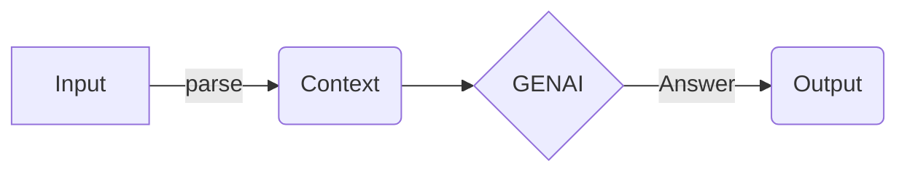

# Future of Organizations - Post GenAI Outlook and Trends

A common conversation I have with Startups and Big Corp leaders alike is, how
would the world evolve with GenAI. These conversations have slightly different
trajectories depending on whether the leader is a technical person or a
product/biz person. While there is a lot of material out there, I have noticed a
BS scale evolving.

<!-- more -->

-   for tech leaders by tech folks - Low to Medium BS.
-   for tech leaders by non-tech folks - Shallow, Medium to High BS
-   For non-tech leaders by tech leaders - Over promises by Low BS
-   For non-tech leaders by non-tech leaders - BS^infinity

This article is my contribution to the pile of BS already there. Where I hope to
not be as bad a bullshit artist, and drop some truth bombs. Ambitious right?
lets get on with it then..

Now, before you dismiss this as just another AI hype piece, let me assure you -
I've been in the trenches of machine learning since early-2009. I've seen the AI
winter, the spring of deep learning, and now the summer of GenAI. So, when I say
I'm about to drop some truth bombs, I mean I'm bringing over a decade of battle
scars and hard-earned wisdom to this conversation.

Let's start by acknowledging the elephant in the room: GenAI is not a magic
wand. It's not going to solve all your problems, make your coffee, or turn your
startup into the next unicorn overnight. But it's also not just a fad that we
can afford to ignore. The reality, as always, lies somewhere in the messy
middle.

In this post, we're going to cut through the noise and get to the heart of what
GenAI really means for organizations. We'll explore:

1. The real capabilities of GenAI - what it can do, what it can't, and what it
   might be able to do soon.
2. How to spot AI snake oil salesmen (trust me, they're everywhere).
3. The organizational changes you need to consider to truly leverage GenAI.
4. Some potentially game-changing applications of GenAI that aren't getting
   enough attention.

So, whether you're a tech leader trying to separate hype from reality, or a
business leader trying to understand if you should be investing in this
technology, buckle up. We're about to embark on a BS-free journey through the
land of GenAI.

And remember, while I promise to keep the BS to a minimum, I'm also here to
challenge your thinking. Some of what I say might contradict what you've heard
elsewhere. Good. That's the point. By the end of this post, I want you to have a
clearer, more nuanced understanding of GenAI and its potential impact on your
organization.

Ready? Let's dive in.

## I. GenAI: The Good, the Bad, and the Utterly Ridiculous

Before we make prophecies for the future, it makes sense to understand what has
changed with Gen AI. We know the tell tale party tricks of an LLM application,
we are also becoming aware of its incoming multi-modal skills.

But to me, the proverbial bulb which has been lit is as follows: All AI before
ChatGPT was looking at our world through a numerical/mathematical lens. It would
take a problem statement, expect the human to parse any set of inputs into a
tensor format, and then it would apply some mathematical transform.

In a way, pre GenAI, everything was a mathematical transform from a fixed tensor
space to another tensor space.

Gen, in generative AI was the tipping point. AI could generate sequences before
too. take an LSTM, or a simple ARIMA model. But those were just statistical
extrapolations. All AI was a clever Mathmatical trickster at best.

Its only when Transformers came into play, and parameter space started to grow,
we started seeing glimses of "generative" capabilities.

An anecdote from the domain of Natural Language Processing comes to mind. We
would have a hard time parsing documents and respresenting them using clever,
domain specific vector models. A subfield called feature engineering was the
buzz back in early 2010s. It was an accepted norm that computers don't
understand words or phrases, just vectors and cosine similarity. Word2vec
changes this conception a bit by showing how good a large parameter trained
vector embedding would be. And whem we started framing the problem as "given a
sequence of tokens, predict the next word", we forced models to learn long,
medium and short term relationships between each token. Its still a mystery and
a raging debate whether human knowledge is just a set of token, phrase and
document level weights afterall.

Anyways, this long winded explanation was building up to a singular point. We
need to remember what made GenAI a game changers. It understands the nuances of
tokens, and through it, the nuances of language. It doesn't know truth from
falsehood, correct from wrong, good from evil, smart from dumb. Its just knows
how to bluff its way to the next token.

So, what is this skill good for?

GenAI is an excellent language parser. It can ingest faster than humans,
understand what it reads, link it to what it has read and use its knowledgebase
to answer questions.

This parsing capability makes it great for applications where you asking it to
make sense of the world and then answer questions about the world.

Non-exhaustively, _Parsing_ can mean reading, expanding, rephrasing, format
conversions, structuring, or translation. Similarly _Answer_ questions can mean
organize, expand, reduce, infer intent, classify or review.

---

## II. GenAI: The Good, the Bad, and the Utterly Ridiculous

Before we dive into future prophecies, let's take a moment to understand what
exactly has changed with the advent of Generative AI. We're all familiar with
the party tricks of LLM applications and their emerging multi-modal skills, but
the real paradigm shift goes deeper.

### A. The Tipping Point: From Mathematical Transforms to Language Understanding

Pre-GenAI, artificial intelligence viewed our world through a purely
mathematical lens. It would take a problem statement, expect humans to parse
inputs into tensor format, and then apply some statistical mathematical
transform. Essentially, everything was a clever mathematical trick, transforming
data from one fixed tensor space to another.

The "Gen" in Generative AI marks a critical tipping point. While AI could
generate sequences before (think LSTM or ARIMA models), these were merely
statistical extrapolations. The game-changer came with Transformers and the
exponential growth in parameter space, giving us the first glimpses of true
"generative" capabilities. These are still, at their core, some form of
statistical models but the parameter space is so huge it stops making sense to a
human at a statistical level.

### B. The Evolution of Natural Language Processing

An anecdote from NLP illustrates this shift perfectly. In the early 2010s, we
struggled with parsing documents and representing them using domain-specific
vector models. Bigram and Trigram models were defacto parsing methods and
further feature engineering was the buzzword. It was accepted that computers
don't understand words or phrases, just vectors and cosine similarity and domain
specific tinkering was absolutely necessary to get the best out of any models.
In a way, each model was trained for a specific problem, with its own specific
features.

Word2vec began to change this conception by demonstrating the power of large
parameter-trained vector embeddings. When we started framing the problem as
"given a sequence of tokens, predict the next word," we forced models to learn
long, medium, and short-term relationships between tokens. Whether human
knowledge is just a set of token, phrase, and document-level weights remains a
fascinating debate.

Its only when we started training transformer models of sufficiently large
parameter space, did we relaize the marvels of transfer learning. Transfer
learning is when you train a model on a particular problem, but can use the
weights learned by the model on a related problem with minimal retraining.
Transfer learning results was the first signs that large transformer models
"knew" about language. It was only a matter of time till these methods were
scaled up with corporate truckloads of money spent in data acquisition and
training. Which brings us to our current post ChatGPT era.

> 💡 There are parallel innovations in image generation and voice transcription
> which plays an important second fiddle to the current wave of GenAI llms which
> I haven't discussed here. The point being NLP understanding gave GenAI the
> human like understanding, image generation gave it visual perception and Audio
> transcription models gave it hearing and listening capabilities

### C. The Core Capability: Understanding Token Nuances

The key takeaway is this: GenAI understands the nuances of tokens, and through
them, the nuances of language. It doesn't inherently know truth from falsehood,
correct from wrong, or good from evil. It simply knows how to predict the next
most likely token based on its training.

Its akin to a human who knows langauge reading and comprehension at a mind
boggling rate, but missed any training in science, mathematics and ethics. It
does know about history and current affairs, much like how someone who has read
a lot of books would. It doesn't have perfect recollection, so it can make
mistakes.

And worst of all, it still has a computer program's heart, which is, you need to
instruct it very precisely to get what you want. Any minor changes to the way
you instruct will bring swings in the quality of the output. It also has a tough
time retaining context. Humans can keep track of the current conversation, what
they talked with their family over the last week and their memories from college
and use all of these memories in a single conversation without a niggle. GenAI
doesn't have this superior memory model and so, its often the case that you've
got to repeat things in your prompts just to that your GenAI side kick remembers
what you talked about.

So, with this small primer on what it can and cannot do well, lets ask the
following question.

### D. What is GenAI good for TODAY?

In short, genAI today has **Superior Language Parsing** Additionally, an aspect
we haven't talked about is merging this language capability with its image
generation capabilities.

GenAI can ingest information faster than humans, understand what it reads, link
it to its existing knowledge base, and use this to answer questions. GenAI can
also structure its output in multiple formats with ease. This includes both
human and program friendly formats which comes in handy when using the output of
GenAI LLMs in function calling input or as input to other traditional programs.

As we move forward, it's crucial to remember that GenAI, while revolutionary, is
a tool with specific strengths and limitations. Its ability to parse and
generate language-based content is unprecedented, but it's not a magical
solution to all problems. Understanding these capabilities and limitations is
key to leveraging GenAI effectively in organizational contexts.

I like to break this Language Understanding into two parts.

1. **Versatile Parsing Applications**: This parsing capability makes it
   excellent for applications where you're asking it to make sense of the world
   and then answer questions about it. Parsing can involve:

    - Reading
    - Expanding
    - Rephrasing
    - Format conversions
    - Structuring
    - Translation

2. **Diverse Question Answering**: The "answering questions" aspect can include:
    - Organizing information
    - Expanding on topics
    - Reducing complexity
    - Inferring intent
    - Classification
    - Reviewing content

In more esoteric use cases you can consider Diverse Question Answering to
include answering with an Image, or a prompt which can be used with another LLM.

Here in lies the first insight.

> 💡 Insight 1: If you want to build or buy an AI solution, can you clearly
> frame what the input would be, how would it be parsed by and human, and what
> the output would look like. In practice, this is a lot like writing a sequence
> diagram before build a backend API system.

Please dont ask AI to comeup with ingenious, correct and original thought. It
can spitball something but like we say in C/C++,this is undefined behaviour.

Most common applications can be modelled as follows

-   Write a blog post for me about Topic X --> parse my intended topic, output
    topic X,intent expant. answer: expand(topic X)
-   Read a pdf and answer a question --> parse: intent = question answering,
    question =user's question. content=parsed PDF text. answer: hopefully an
    answer.
-   Generate an image from a prompt --> parse: intent = image generation,
    description = user's input, answer: an image prompt, or if the output layer
    is an image generation layer, then this image prompt is fed directly to a
    transformer which understands images.

> 💡 Insight 2: GenAI LLMs are universal functions. A one size fits many
> function call which changes its behaviour depending on the input it gets.

<!-- To simplify our discussion, lets take a concrete GenAI usecase and subject it to -->
<!-- our analysis. -->

<!-- With a clear scope of input and output and an understanding of what parsing and -->
<!-- answering phase would look like, we need to move to feasibility and limitations. -->

## III. GenAI Applications You Can Use Today

GenAI isn't just a futuristic concept; it's already making waves across various
sectors. Let's break down some practical applications that enterprises, small
businesses, and individuals can leverage right now.

### Enterprise Applications

1. **Advanced Customer Support**

    - AI-powered chatbots for 24/7 customer service
    - Automated ticket classification and routing
    - Generation of personalized responses to customer inquiries

2. **Content Creation and Management**

    - Automated report generation from data inputs
    - Drafting and editing of marketing materials
    - Creation of multilingual content for global markets

3. **Code Assistance and Documentation**

    - Automated code review and bug detection
    - Generation of code documentation and comments
    - Conversion between programming languages

4. **Data Analysis and Insights**

    - Natural language queries for complex databases
    - Automated generation of data visualization scripts
    - Trend analysis and predictive modeling

5. **HR and Recruitment**
    - Resume screening and candidate matching
    - Generation of job descriptions
    - Personalized employee training content

### Small Business Applications

1. **Marketing and Social Media**

    - Generation of social media posts and ad copy
    - Content ideation for blogs and newsletters
    - SEO optimization for website content

2. **Financial Management**

    - Automated invoice generation and processing
    - Financial report summarization
    - Cash flow prediction and analysis

3. **Customer Engagement**

    - Personalized email campaigns
    - FAQ generation, frequent update and management
    - Review response drafting

4. **Product Development**

    - Market research summarization
    - Product description generation
    - Feature ideation based on customer feedback
    - Updating product spec based on human interactions in documents, meetings
      and human input.

5. **Operations Optimization**
    - Standard Operating Procedure (SOP) drafting
    - Inventory management assistance
    - Scheduling and task prioritization

### Personal Use Cases

1. **Writing and Creativity**

    - Essay and article drafting
    - Creative writing prompts and story ideas
    - Proofreading and editing assistance

2. **Learning and Education**

    - Personalized study guides and summaries
    - Language learning assistance
    - Explanation of complex concepts in simple terms

3. **Personal Productivity**

    - Email drafting and summarization
    - To-do list generation and task breakdown
    - Meeting notes summarization

4. **Health and Wellness**

    - Meal planning based on dietary restrictions
    - Workout routine generation
    - Mental health journaling prompts

5. **Home Management**
    - Recipe creation from available ingredients
    - Home decoration ideas
    - DIY project instructions

While these applications showcase the current capabilities of GenAI, it's
crucial to remember that human oversight and verification remain essential.
GenAI excels at generating ideas, drafting content, and processing information,
but it's not infallible. The most effective use of GenAI comes from combining
its capabilities with human expertise and judgment.

As we continue to explore and expand the applications of GenAI, we're likely to
see even more innovative uses across various sectors. The key is to approach
these tools with a clear understanding of their strengths and limitations,
always keeping the end goal and user needs in focus.

## IV. The Snake Oil Detector: A Comprehensive Toolkit for Leaders Evaluating GenAI Solutions

In the rapidly evolving landscape of Generative AI, it's crucial to distinguish
between genuine innovations and overblown promises. This toolkit aims to equip
organizational leaders with the necessary questions and criteria to evaluate
GenAI solutions critically.

### 1. Key Questions to Ask AI Vendors

-   What specific problem does your AI solution solve?
    -   Can you provide concrete, measurable metrics for the AI's performance?
-   How was your AI model trained, and on what kind of data?
-   What are the known limitations or edge cases for your AI?

### 2. Understanding Current AI Limitations

-   Hallucinations in language models: AI can generate plausible but incorrect
    information
-   Challenges in context understanding and common sense reasoning
-   Does your AI solution Data dependency: AI models are only as good as the
    data they're trained on
-   The "black box" nature of some AI decision-making processes

### 3. Data Ingestion and Representation

-   How does the vendor handle ingestion of different data formats?
-   What is their strategy for data preprocessing and enrichment?
-   Can they explain their approach to context extraction from complex data
    structures (e.g., HTML pages)?
-   Do they have a clear understanding of how data representation affects AI
    performance?

**Red flags:**

-   Inability to discuss data ingestion strategies for various file formats
-   Lack of clear explanation about their data integration processes
-   Oversimplified approach to data representation (e.g., treating all text as
    simple tokens)

### 4. Human-in-the-Loop and Continuous Improvement

-   Is there a mechanism for human oversight between user input and AI output?
-   How does the system incorporate user feedback?
-   Is there a strategy for refining the model based on past errors?
-   What is the frequency and process for model updates and improvements?

**Red flags:**

-   Claiming that human oversight or feedback integration is unnecessary
-   No clear strategy for model refinement based on usage and errors
-   Lack of a system for recording and analyzing AI performance over time

### 5. Evaluating AI Implementation Requirements

-   Assess the necessary changes to existing workflows and processes
-   Consider the required computational resources and infrastructure
-   Evaluate the need for ongoing maintenance and updates
-   Understand the level of AI expertise required within the organization

### 6. Red Flags in AI Product Pitches

-   Vague or overly broad claims (e.g., "Our AI can do anything!")
-   Lack of transparency about the AI's capabilities and limitations
-   Unwillingness to provide demos or proof-of-concepts
-   Promises of 100% accuracy or completely eliminating human involvement
-   Inability to explain how the AI makes decisions

### 7. Assessing Long-term Viability

-   Consider the AI company's track record and stability
-   Evaluate the scalability of the AI solution
-   Understand the potential for vendor lock-in
-   Assess the alignment with your organization's long-term strategy

### 8. Ethical and Security Considerations

-   Examine potential biases in the AI's decision-making
-   Consider the impact on employees and stakeholders
-   Evaluate transparency and explainability of the AI's processes
-   Assess compliance with relevant regulations (e.g., GDPR, CCPA)

### 9. Security and Privacy Protection:

-   How does the AI product prevent inadvertent leakage of Personally
    Identifiable Information (PII)?
-   What access control mechanisms are in place for the AI system?
-   How is data encrypted and protected both at rest and in transit?
-   What is the vendor's protocol for handling potential data breaches?

### 10. Safeguards Against AI Manipulation:

-   How does the product protect against prompt injection attacks?
-   What measures are in place to prevent the AI from generating unethical,
    unsavory, or dangerous responses?
-   Is there a content filtering system in place? How is it maintained and
    updated?
-   What is the process for handling and learning from security incidents?

**Red flags:**

-   Lack of robust access control mechanisms
-   Inability to explain measures for preventing PII leakage
-   No clear strategy for dealing with prompt injection or other AI-specific
    attacks
-   Absence of content moderation or filtering systems
-   Dismissive attitude towards the potential for AI to be manipulated or
    misused

By applying this comprehensive toolkit, organizations can cut through the hype
and make informed decisions about GenAI implementations. Remember, a trustworthy
AI vendor should be able to address these points clearly and honestly,
acknowledging both the strengths and limitations of their solution. This toolkit
not only helps in evaluating the technical capabilities of GenAI solutions but
also ensures that ethical, security, and long-term viability aspects are
thoroughly considered.
