---
title:
    Bike Shedding and the Law of Triviality - Lessons from the Linux Kernel
    Conflict
created: 2024-09-10 02:14
date: 2024-09-10
public: true
coverImage: https://images.prismic.io/thedecisionlab/0eb368eb-0bdf-49c7-996f-23020e94be34_Bikeshedding.jpg?auto=compress,format
categories:
    - engineering
    - leadership
tags:
    - topic/bike-shedding
    - topic/team-management
    - topic/open-source
topic:
    - leadership
description:
    Explore the concept of bike shedding in product teams, using the recent
    Linux kernel conflict as a case study. Learn how to spot and prevent trivial
    debates from derailing progress, with practical advice for leaders in
    startups and open-source communities.
---

# Bike Shedding and the Law of Triviality: Lessons from the Linux Kernel Conflict

In product teams, especially in open-source communities and startups, **bike
shedding**—focusing on trivial, superficial details at the expense of more
significant issues—can derail progress. Recent disputes in the Linux kernel
community between developers over introducing Rust highlight how the law of
triviality can cause friction and stagnation. This post explores the concept of
bike shedding, using this real-world example to illustrate its effects, and
provides practical advice on how leaders can prevent it.

<!-- more -->

## Table of Contents

-   [What is Bike Shedding?](#what-is-bike-shedding)
-   [The Law of Triviality in the Linux Kernel Conflict](#the-law-of-triviality-in-the-linux-kernel-conflict)
-   [Case Study: Rust vs C](#case-study-rust-vs-c)
    -   [Primeagen's Commentary](#primeagens-commentary)
    -   [Drew DeVault’s Take](#drew-devaults-take)
-   [Spotting and Avoiding Bike Shedding in Teams](#spotting-and-avoiding-bike-shedding-in-teams)
-   [Toolkit for Leaders](#toolkit-for-leaders)

## What is Bike Shedding?

Bike shedding, or **Parkinson’s Law of Triviality**, refers to a phenomenon
where people spend disproportionate amounts of time on trivial details rather
than critical issues. The term was coined by C. Northcote Parkinson in 1957,
when he observed that committees tasked with approving the construction of a
nuclear power plant spent more time discussing trivial matters like the
materials for a bike shed than on the reactor's design.

In software engineering, this manifests in endless debates over minor features
or aesthetic choices while significant architectural or technical challenges are
left unresolved. The implications of bike shedding are **wasted time**, **slowed
progress**, and **team frustration**, which can be disastrous, especially for
product teams in **startups** and **open-source projects**.

## The Law of Triviality in the Linux Kernel Conflict

A recent, highly publicized conflict in the Linux kernel community serves as a
perfect case study of how bike shedding can wreak havoc. The dispute centers
around the introduction of Rust, a modern programming language, into the kernel,
which has traditionally been written in C. While the benefits and challenges of
using Rust in the kernel are legitimate topics for discussion, the debates have
devolved into petty arguments and personal attacks.

Drew DeVault’s blog on this topic highlights the core issue:

> "In practice, the Linux community is the wild wild west, and sweeping changes
> are infamously difficult to achieve consensus on, and this is by far the
> broadest sweeping change ever proposed for the project. Every subsystem is a
> private fiefdom, subject to the whims of each one of Linux’s 1,700+
> maintainers, almost all of whom have a dog in this race."

The introduction of Rust is a complex task—one part coding and ninety-nine parts
political work. But instead of focusing on the critical technical and political
challenges, the community has become entangled in irrelevant disputes.

## Case Study: Rust vs C

To illustrate how such law of triviality can derail hard work and forward
movement there's no better situation that the current chaos happening on LKML
(linux kernel mailing list) Issue at hand is a recent exodus of Rust maintainers
due to the brewing conflict between C devs and rust devs. Things have come to a
flash point in recent times and its best I let you discover the context through
some Youtube vides by Primeagen and a few blog posts. We don't want to disucss
the Rust vs C issue directly, but use it to highlight how toxic things can
become and how it usually lets to suboptimal collaboration and impact.

> Primeagen's Commentary

[Primeagen’s video](https://www.youtube.com/watch?v=T2OKdv4SPdQ) provides a
commentary on this issue, dissecting how bike shedding has escalated in the
Linux kernel discussions. The community is divided between proponents of Rust
and die-hard C advocates, with both sides engaging in what Primeagen describes
as a **"toxic back-and-forth."** He highlights that the arguments have become
more about personal attacks and less about solving real problems.

<iframe width="560" height="315" src="https://www.youtube.com/embed/T2OKdv4SPdQ?si=HKTIl-GrCMvu-mSd" title="YouTube video player" frameborder="0" allow="accelerometer; autoplay; clipboard-write; encrypted-media; gyroscope; picture-in-picture; web-share" referrerpolicy="strict-origin-when-cross-origin" allowfullscreen></iframe>

> [:NOTE] Drew DeVault’s Take

In a blog post titled
["Rust in Linux Revisited"](https://drewdevault.com/2024/08/30/2024-08-30-Rust-in-Linux-revisited.html),
Drew DeVault provides a more grounded analysis of the situation. He criticizes
the toxic behavior that has arisen, calling it out in a way that doesn’t fan the
flames of the conflict. I love how DeVault writes this in the footnote. Not in
the blog body, where it would derail a readers focus from constructive advice
into petty gossiping, and yet delivers a stinger to the intended person. bravo!

> "Yes, I saw that video, and yes, I expect much better from you in the future,
> Ted. That was some hostile, toxic bullshit."

This statement exemplifies how a leader can address bad behavior without making
the situation worse. The toxic culture in the Linux kernel community, as
observed by DeVault, is a classic example of bike shedding spiraling out of
control.

## Spotting and Avoiding Bike Shedding in Teams

**How can you tell if your team is bike shedding?** Here are some warning signs:

1. **Disproportionate focus on minor issues**: Are team members spending more
   time arguing over font choices in the UI than the core functionality of the
   product?
2. **Endless debates with no resolution**: Discussions drag on with no clear
   decision, wasting time and energy.
3. **Personal attacks or toxic behavior**: When arguments become personal, it’s
   a sign that the conversation has drifted away from the real issues.

Bike shedding can happen in various forms across different teams, not just in
programming but also between product management, engineering, sales, and
leadership. Here are some common cases and strategies for spotting and avoiding
it:

### Disproportionate Focus on Minor Issues

This can occur when team members fixate on relatively trivial matters, causing
bigger issues to be neglected. Here are some real-world examples:

-   **Product Management vs. Engineering**: Imagine a product manager wants to
    introduce a small UI change that makes a button a slightly different shade
    of blue. The engineering team gets caught up in technical discussions about
    which library to use for the color update, resulting in hours of debate
    while a critical backend service outage is left unattended. The team has
    effectively **lost focus on the bigger picture**: maintaining uptime and
    customer experience. Leaders need to ask, "Does this decision meaningfully
    impact the product or user experience?"

-   **Sales vs. Product**: Sales teams often push for features that might help
    close a deal with a particular client, leading to one-off development
    efforts. If the product team caves into these demands every time, they risk
    derailing their roadmap. Here, **disproportionate focus on closing a deal**
    can lead to technical debt, bloated products, and unhappy customers down the
    line. Instead, sales and product should align on the overall product vision
    to prevent such misalignment.

-   **Leaders vs. Teams**: Leaders can sometimes fixate on performance metrics
    or minute budget details, demanding exhaustive updates from the team about
    things that don’t materially affect overall business outcomes. This may
    happen at the expense of tackling systemic issues, such as improving team
    morale or addressing technical debt. This form of **micro-management** can
    be another version of bike shedding, where **trust is undermined** and
    **innovation stifled**.

### Endless Debates with No Resolution

Unresolved debates are classic symptoms of bike shedding. Teams can find
themselves stuck in a loop of back-and-forth discussions about trivial details,
such as **how to name a feature** or **whether to implement something in Python
or Go**. Here's how leaders can intervene:

1. **Set timelines for decisions**: Introduce deadlines for discussions to
   ensure they don't stretch on indefinitely. Say, "Let's reach a conclusion on
   this by the end of the week," and stick to it. The key here is balancing
   **flexibility with accountability**.
2. **Define the scope of the discussion**: If teams are debating endlessly over
   something insignificant, it’s often because the scope hasn’t been set. As a
   leader, say something like, "We’re going to focus on solving this problem,
   not revisiting decisions from last quarter." Setting clear boundaries can
   **reduce friction** and help everyone focus.

3. **Encourage concise communication**: Encourage team members to come prepared
   with their points and limit the time each person spends talking. If the same
   points are being repeated over and over, it’s a signal that the decision
   process needs to move forward.

### Personal Attacks or Toxic Behavior

**I’ve been guilty of this myself**, especially when frustration overtakes logic
and composure. It's easy to snap at a colleague or team member during
high-stress situations, but **that moment of losing your temper stays with you**
far longer than the person you were arguing with. Even worse, personal attacks
create a toxic environment that **undermines trust** and **erodes
collaboration**.

Leaders must be vigilant about spotting toxic behavior early on. If a team
member lashes out in frustration, it's your job to:

1. **Address the behavior, not the person**: Instead of saying, "You were out of
   line," reframe it as, "We can’t let this discussion devolve into personal
   criticisms. Let’s refocus on the issue at hand."
2. **Model composure**: As a leader, **your behavior sets the tone** for the
   rest of the team. If you lose your temper, your team will feel it's
   acceptable to do the same. Keep your emotions in check and offer an apology
   if you make a mistake. Remember, **emotional intelligence is a critical
   leadership skill**.

3. **Coach team members on conflict resolution**: If people consistently engage
   in toxic behavior, it may stem from stress or misaligned priorities. Offer to
   help them **manage stress** and learn better ways to communicate their
   frustrations.

Bike shedding isn’t always obvious at first, but by focusing on **priority
setting, conflict management**, and **emotional intelligence**, leaders can
guide their teams away from the trivial and towards meaningful work.

## Toolkit for Leaders: Preventing and Resolving Bike Shedding

If you notice bike shedding in your team, here are some strategies to mitigate
it:

1. **Set clear priorities**: Clearly define which issues are critical and
   deserve attention.
2. **Timebox discussions**: Limit the time spent on trivial matters and push for
   decisions.
3. **Encourage respectful debate**: Promote a culture of constructive criticism
   and discourage personal attacks.
4. **Identify the root cause**: If bike shedding persists, dig deeper to find
   out what’s really causing the tension—often, it’s a symptom of underlying
   issues.
5. **Reframe the conversation**: Bring the focus back to the big picture and
   remind the team of the overall goals.

Leaders play a critical role in recognizing and addressing bike shedding within
their teams. After a bit of thought structuring, I have come up with the
following situations which we encounter and an action plan for managing each
such situation. I have organized the discussion from immediate problems to
preventive actions. Each step emphasizes active leadership and communication to
keep teams focused on meaningful work.

### Resolving Active Bike Shedding Situations

When a team has already fallen into the trap of bike shedding, leaders need to
intervene swiftly and decisively. Here’s how:

1. **Refocus on Priorities**: When bike shedding is in full swing, remind the
   team of the bigger picture. Say something like, “I understand this is
   important, but let’s refocus on our main objective: delivering feature X by
   the end of the quarter.”

2. **Identify Decision-Makers**: Bike shedding often happens because no one is
   clear on who has the authority to make the final call. Assign a
   decision-maker who is empowered to move the conversation forward. For
   example, "I’m delegating the decision on this to John. We need a resolution
   by tomorrow."

3. **Set a Hard Stop**: Interrupt endless debates by setting a clear deadline
   for resolution. “We will allow 15 more minutes for discussion, then we’ll
   vote and move on.” This enforces a sense of urgency and encourages concise
   communication.

4. **Acknowledge, But Move Forward**: Acknowledge valid concerns raised during
   bike shedding, but don’t let them derail progress. "I hear the concerns about
   implementation details, but we need to get started. We can revisit this later
   if necessary."

```mermaid
graph TD;
    A[Is this topic important? 🤔] -->|Yes| B{Does it have a direct impact on business? 📈};
    A -->|No| F[End discussion 🚫];
    B -->|Yes| C[Continue discussing 🔄];
    B -->|No| D{Is the team spending too much time on this? ⏳};
    D -->|Yes| E[Move on to more important tasks 🚀];
    D -->|No| C;
```

### Stopping Bike Shedding Before It Begins

Leaders should be proactive in spotting early signs of bike shedding and
stopping it before it snowballs:

1. **Define Scope Early**: At the start of any discussion, make the scope clear.
   “We’re discussing how to roll out the feature, not rethinking its design.
   Let’s stay focused on the ‘how’.”

2. **Set Clear Boundaries for Feedback**: Structure discussions to avoid endless
   back-and-forths. “We’ll gather feedback from everyone, but decisions will
   ultimately rest with the tech lead.”

3. **Encourage Action-Oriented Discussions**: Instead of open-ended debates,
   frame discussions around next steps. Ask questions like, “What actions can we
   take today to solve this?” This discourages theoretical debates and promotes
   practical solutions.

4. **Enforce ‘Good Enough’ Decisions**: Some decisions don’t require perfection.
   Teach your team the value of making decisions that are “good enough” for now,
   with the understanding that they can iterate later if needed. “This doesn’t
   need to be perfect—we’ll revisit it during the next sprint.”

### Training Your Team and Mentors to Avoid Bike Shedding

Preventing bike shedding requires ongoing training and mentorship. Leaders
should invest in long-term cultural changes that promote focus and
accountability:

1. **Teach Prioritization Skills**: Host workshops or 1:1 sessions on
   prioritizing high-impact tasks over trivial details. Share frameworks like
   the Eisenhower Matrix to help team members evaluate what’s important versus
   what’s urgent.

2. **Promote Ownership**: Encourage team members to take ownership of their
   decisions. When people feel accountable for an outcome, they’re less likely
   to waste time on trivial issues. Empower them to make decisions without
   needing consensus on every small detail.

3. **Mentor for Conflict Resolution**: Train mentors to step in when they notice
   bike shedding happening among their mentees. They should coach their teams to
   resolve disagreements constructively and move forward instead of dwelling on
   minor issues.

4. **Role-Playing Exercises**: Use real-world scenarios where bike shedding
   occurred in your team and role-play ways to resolve it. This not only
   provides practice but also normalizes quick decision-making over drawn-out
   debates.

### Running Retrospectives for Situations Where Bike Shedding Happened

After the fact, it’s essential to reflect on why bike shedding was allowed to
occur. Running retrospectives on these situations will help teams learn from
their mistakes:

1. **Acknowledge the Problem**: Start by acknowledging that bike shedding
   happened, and frame the retrospective as a learning opportunity, not a blame
   game. “We spent too much time debating X during the last sprint. Let’s unpack
   why that happened.”

2. **Ask Key Questions**: Structure the retrospective around questions that help
   uncover the root cause:

    - Why did we focus so much on this issue?
    - What could we have done differently to resolve this faster?
    - How can we prevent this from happening again?

3. **Encourage Open Dialogue**: Create a safe space for team members to speak
   candidly about what they noticed. Sometimes, bike shedding can stem from
   unspoken team dynamics, such as a lack of clear decision-making authority or
   fear of stepping on someone’s toes.

4. **Extract Key Takeaways**: Once the discussion has unfolded, help the team
   distill their learnings into actionable takeaways. “Next time, let’s set a
   hard stop for discussions and ensure we assign someone to make the final
   decision.”

5. **Set New Norms for Future Discussions**: Use the retrospective to establish
   new rules for decision-making or team discussions. This could be something
   like, “We’ll now limit open-ended discussions to 20 minutes, then we’ll
   decide.”

---

By actively implementing these strategies, leaders can mitigate the risk of bike
shedding and create an environment where the team remains focused on meaningful,
impactful work.

## Footnotes

[Primeagen’s commentary on the Rust vs C debate in the Linux kernel](https://www.youtube.com/watch?v=T2OKdv4SPdQ)  
[Drew DeVault’s "Rust in Linux Revisited"](https://drewdevault.com/2024/08/30/2024-08-30-Rust-in-Linux-revisited.html)
[Linus is pretty clear with his expection on Rust in FS. He just wants things to be simple to test, crash early and in general be more testable](https://lkml.org/lkml/2020/7/10/1261)

<!--
WRITING INSTRUCTION
- First - study the comments, instructions thoroghly atleast three times. This is important.
- Research the links provided with the context given for why the link was included.  Use tools to get webpages or youtube transcripts always.
- Reason about a high level narrative structure and flow for the blog.  We have included the title and the footnotes.  Everything else needs to be fleshed out.
- Start by writing a Table of Content. Use H2 and h3 only.  We don't want too many levels of nesting.
- Review if the Table of content flows well. Titles need to be short to medium, and don't make them boring.  A bit of wit is good to have but don't try too hard.
- Start writing the sections one at a time. Write, review the section,  check if the section flows well from the previous section. Follow the following directions for writing sections
   - Introductions shouldn't be too long.  Explain why you are writing this, tell the person why its important, how you've laid out the blog and whats in it for the reader. You need to have the first paragraph engaging and something which hooks a reader and keeps them from bouncing off the page.
   - Each section should use proper emphasis like bold/italics, urls,  and footnotes where appropriate.
   - If something can be represented concisely in ordered or unordered lists, please do so.
   - Use code snippets for technical topics. This isn't necessary, use wisely. For programming topics do use code examples.
   - In between sections  you can use markdown comments to write down rough notes about what you intend to add in those sections. This will guide you in getting feedback from me, as well as save us iterations when we go into the whole content writing.

BLOG DESCRIPTION
A blog post about bike shedding, the law of triviality and how it affects product teams, specially in startups and opensource.

Recent open source problems in linux kernel mailing list. We want to cover this in short, key highlights with links for people who are interested. We don't want to digress into rust vs c issue, but rather use it as a case study for bike shedding and energy lost in trivial fights.
-   rust devs vs C devs have been fighting about the velocity of change. both parties have fair and nuanced points but the discussions are turning pedantic and outright toxic.
-   FS maintainers and Rust presenters had an ugly showdown as witnessed here in this youtube video - https://www.youtube.com/watch?v=WiPp9YEBV0Q
    -   We need to cover, primeagen's video here  https://www.youtube.com/watch?v=T2OKdv4SPdQ  which triggered this post.
- drew devaults post here https://drewdevault.com/2024/08/30/2024-08-30-Rust-in-Linux-revisited.html  is a very sensible take on this situation.

We want to convey a toolkit for leaders to spot if their teams or people are engaging in useless bike shedding, how to spot this early, how to mitigate this in teams.

-->

---

<!--

NOTE:  We want to incorporante this quote in our blog.  this is from drew's blog. very direct and honest.
> In practice, the Linux community is the wild wild west, and sweeping changes
> are infamously difficult to achieve consensus on, and this is by far the
> broadest sweeping change ever proposed for the project. Every subsystem is a
> private fiefdom, subject to the whims of each one of Linux’s 1,700+
> maintainers, almost all of whom have a dog in this race. It’s herding cats:
> introducing Rust effectively is one part coding work and ninety-nine parts
> political work – and it’s a lot of coding work. Every subsystem has its own
> unique culture and its own strongly held beliefs and values.

NOTE:
This is a good trait of leaders. They call out bad behavior, without giving anyone the opportunity to make the narrative about them being called out.
The footnote on the blog from drew is very straight forward and calls out bad behviour. It does that respectfully and hides it well in a footnote so the name calling is not front and center.
> Yes, I saw that video, and yes, I expect much better from you in the future,
> Ted. That was some hostile, toxic bullshit. ↩︎
-->

---
