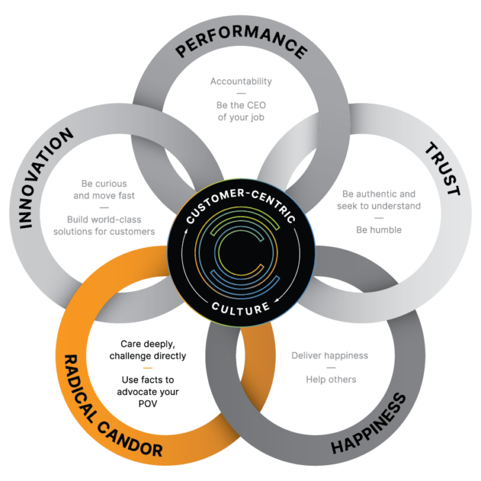
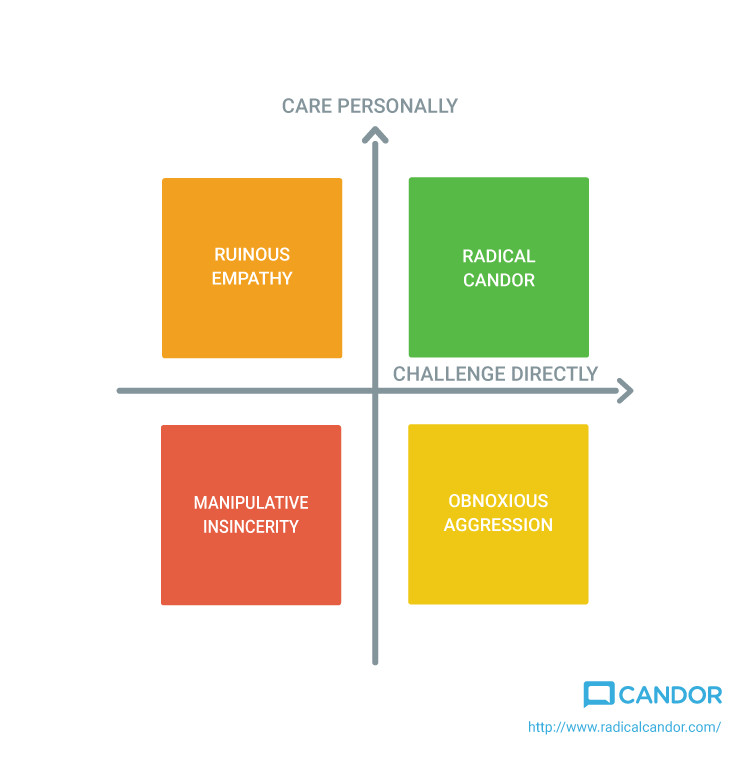

---
tags:
    - topic/leadership
    - topic/management
    - topic/culture
categories:
    - Management
title: Navigating Radical Candor, the Delicate Balance Between Trust and Honesty
ShowToc: true
date: 2024-09-04
---

# Navigating Radical Candor: The Delicate Balance Between Trust and Honest Feedback

<!-- Talk about your sabbatical. -->

<!-- Talk about reflection and how the time you have has removed busywork of -->
<!-- management/startups and lets you reflect on the issues that plague companies in -->
<!-- their 0-1 and 1-100 journey -->

<!-- About Radical Candor. I have always identified with this way of working. We -->
<!-- operate with honest clarity in my family. It does get hairy in marriage. Still -->
<!-- working on this. -->

## The Radical Candor Conundrum

I've often grappled with how to give feedback without coming across as too harsh
or too soft. Navigating this fine line has always baffled the engineer in me -
I've seen the same approach work in some cases and backfire in others. It
becomes even more challenging when I need to mentor others to practice the same.
How am I to teach someone Radical Candor when I myself haven't always done it
right.

Some situations are truly heartbreaking when someone approached a situation with
utmost care and empathy at my behest and yet the perceived feedback was largely
badly received. This has been a constant wonder for me, something which makes
working with Humans so much more intriguing.

In fact, the more I think about it, the more I realize how much of a tightrope
it really is. Radical Candor, a concept that emphasizes caring personally while
challenging directly, is something I've always believed in, but practicing it
effectively is another story.

## The Importance of Trust

Over the last few months, with ample time to read and reflect, I think I know
why some feedbacks even though they were point blank and direct, were received
well and did help the receiver. While in other situations the situation cause a
rift between people. In trying to write my thoughts down, I came across some
great writing and saw this picture. There it was hiding on a blog page of an AI
integration company who was helping a consulting client of mine.

It was so well thought out that I had my aha! moment.

So today we will talk about two circles in this diagram. Radical Candor and
Trust.

> Key ingredient, or rather, the pre-requisite for Radical Candor to work is
> Radical Trust.

I have been working with a few teams and got a peek into their culture as an
outsider. This is a welcome change from me being one of the protaganists in my
usual roles. I keep seeing situations where the teams have an element of
depleted trust. With the luxury of not being affected directly from these
situations, I got to look at patterns from my past experiences at my job.
Specially those situations where radical candor in a depleted trust scenario has
worked against me.

While researching more on the topic, I chanced upon a comment. It struck a chord
so deep that I am compelled to copy an excrept from this comment by
[@grandalf on hackernew](https://news.ycombinator.com/user?id=grandalf) in this
[thread](https://news.ycombinator.com/item?id=10646491)

_"If there is sufficient trust, there is no issue with candor because you just
say what you want, and everyone knows you are trying to make things better. When
trust breaks down, your words might seem critical or like personal attacks."_

That's when it occured to me. Everytime failed radical candor scenario in my
personal experiece was either because we were in a depleted trust sutuation or
there was an error in the way candor was practiced.

Trust is the invisible thread that holds Radical Candor together. Without it,
the entire framework falls apart. Imagine giving Alex that tough feedback
without a foundation of trust—how do you think they'd react? Probably not well.
They might feel demoralized, defensive, or even resentful.

### Forstering a Culture of Trust

Drawing insights from that insightful Hacker News comment, let's look at some
scenarios where managers could unknowingly be creating a low-trust environment
These scenarios also act like a red herring to assess trust in your teams.

1. _Finger-Pointing and Pressure to Lowball Estimates_ When a project falls
   behind schedule, the natural instinct for some managers might be to start
   pointing fingers and putting undue pressure on the team to deliver. They
   demand tighter, more conservative estimates, even if it means setting the
   team up for failure. This kind of behavior erodes trust, as the team
   perceives the manager as more interested in protecting their own position
   than genuinely supporting the team's success. As the Hacker News commenter
   said, "When there is finger pointing and pressure to lowball estimates, there
   is a trust breakdown from the outset." Instead, the manager should focus on
   adjusting scope or timelines collaboratively, demonstrating that they're in
   it together with the team.

2. _Lack of Transparency around Performance and Growth_ Another trust-eroding
   scenario is when managers are not transparent about performance evaluations
   and growth opportunities. If team members feel like the criteria for
   advancement are unclear or that the process is biased, they're less likely to
   trust that their manager has their best interests in mind. As the commenter
   noted, "It must be OK to be honest in either direction, which means the firm
   should respect it if the employee wishes to leave, and the employee should
   respect it if the firm isn't happy with performance and there doesn't appear
   to be a path to improvement." Fostering that level of mutual respect and
   transparency is key to building trust.

3. _Inconsistent or Insincere Feedback_ When managers provide feedback
   inconsistently or in a way that feels insincere, it can severely undermine
   trust. If the team perceives that the manager is "sugarcoating" issues or not
   being fully transparent, they'll start to doubt the manager's motives and
   credibility. It gets worse the higher up you are and the more ambiguous your
   responsibilities are. Truth be told, I have seen a lot more incompetent
   bosses who were perfectly fine humans but really unprepared people leaders. A
   tell-tale sign of your boss not being up to the mark is when you see them
   delegate doing the dirty work. They deliver bad news by proxy or take tough
   decisions in the shadows and make others deliver it for them, often with
   justifications galore and sugarcoating. This subturfuge is often plainly
   obvious and makes them loose trust and credibility.

Building a culture of trust isn't a one-time effort. It's an ongoing process
that requires consistency, transparency, and a genuine commitment to the
well-being of your team. It's about having the tough conversations, not just
when things go wrong, but also when they're going right. It's about recognizing
the good, while still pushing for better.

There's a phrase that I've come across:

> "Radical Candor can't exist without Radical Trust and Radical Acceptance of
> feedback"

It struck a chord with me because it highlights the interconnectedness of the
person giving feedback and the one receiving it. You can't just focus on being
candid without also working on trust before hand and the person listening to be
accepting of your feedback.

If you ask me, this comment sums it up.

> "If there is sufficient trust, there is no issue with candor because you just
> say what you want, and everyone knows you are trying to make things better.
> When trust breaks down, your words might seem critical or like personal
> attacks." Maintaining a consistent, genuine approach to feedback is crucial
> for building that foundation of trust.

The key takeaway is that trust is fragile and easily eroded when managers act in
ways that are perceived as self-serving, dishonest, or inconsistent. By focusing
on transparency, mutual respect, and a genuine commitment to the team's success,
managers can create an environment where Radical Candor can truly thrive. If
trust is present, then the next key ingredient will be caring personally and
challenging directly. Anything else and the dough doesnt rise.

## Balancing Care and Challenge

In one of Kim Scott’s articles, the orginal proponent of Radical Candor, she
emphasizes this point: _“The whole point of Radical Candor is that it really is
possible to Care Personally and Challenge Directly at the same time.”_ But it’s
easier said than done. I’ve seen leaders who genuinely believed they were
practicing Radical Candor, but their teams perceived them as overbearing or
insincere. It made me question whether we’re all really getting it right.

And I think this picture is very telling.

Just so that we align clearly and unambiguously on what this picture means, I
have written down my tldr for each quadrant of the Radical Candor model:

-   **Radical Candor** is kind and helpful.
-   **Obnoxious Aggression** is mean but may be helpful. Obnoxious Aggression is
    also called "brutal honesty" or "front stabbing."
-   **Ruinous Empathy** is "nice" but ultimately unhelpful or even damaging.
-   **Manipulative Insincerity** is a stab in the back. I have witnessed this,
    and trust me, this is the number one reason why culture breaks down in
    organizations.

In the spirit of radical candor, I would say i find myself 60% in radical
candor, 25% in Obnoxious aggression and 15% in Ruinous Empathy to the best of my
estimates.

I notice I slip into Obnoxious aggression when I feel trust is depleted, I am
being manipulated or someones being insincere to my face when I know through
others they have other designs. It doesn't make it any better, but its good to
know my inner workings so that i can course correct. Its easier to see your own
destructive patterns and check yourself. Its like following radical candor with
your alter-ego.

## Scaling Radical Candor

Finding the right balance between caring and challenging is tricky, and I often
wonder if I've gotten it right. It's not about being perfect, though—it's about
being intentional. It's about recognizing when you're slipping into what Scott
calls "Obnoxious Aggression" or "Ruinous Empathy", and course-correcting.

And then there's the issue of how Radical Candor scales in larger organizations.
In a small team, trust can be easier to cultivate, but what happens when you're
leading a larger group, or even an entire company? How do you maintain that
balance when the stakes are higher, and the dynamics are more complex? These are
questions that I don't have all the answers to, but they're worth reflecting on.

## Final Thoughts

Radical Candor is a journey, not a destination. It's something we practice,
reflect on, and improve over time. But it's not just about personal growth -
it's about cultivating a culture where Radical Candor can truly thrive.

As leaders, we have to be vigilant in recognizing the signs when we or our team
members start slipping into the less-than-ideal quadrants of the Radical Candor
model. When trust is depleted, it's easy to fall into Obnoxious Aggression. And
in an effort to avoid conflict, we can sometimes drift into Ruinous Empathy.
Being able to self-reflect and course-correct is crucial.

But the real key lies in building a foundation of trust. Without it, Radical
Candor becomes nigh impossible. It's about creating an environment where
feedback is seen as an act of care, not an indictment. Where team members feel
safe to be vulnerable, challenge each other, and grow together.

This isn't something that happens overnight. It requires consistency,
transparency, and a genuine, sustained commitment to the well-being of your
people. It means having the tough conversations, celebrating the wins, and
always striving to push each other to be our best selves.

It's a delicate balance, to be sure. But if we can get it right, the payoff is
immense. We unlock the true power of Radical Candor - the ability to unlock
human potential, drive meaningful progress, and cultivate a thriving,
trust-filled culture.

So let's not just practice Radical Candor ourselves. Let's be intentional about
building the conditions that allow it to flourish. Because at the end of the
day, that's what truly great leadership is all about.

---

## Footnotes

-   [Kim Scott on Radical Candor](https://kimmalonescott.medium.com/a-hip-approach-to-feedback-how-to-achieve-radical-candor-84722c356ce8)
-   [Praise vs. Manipulative Insincerity](https://www.radicalcandor.com/blog/praise-manipulative-insincerity/)
-   [Hacker News Discussion on Candor and Trust](https://news.ycombinator.com/item?id=10646491)
-   [Humble Feedback: A Guide](https://www.radicalcandor.com/blog/give-humble-feedback/)
-   [Integrate Blog: Our Cultural Pillars - Radical Candor](https://www.integrate.com/blog/our-cultural-pillars-radical-candor)
-   [Radical Candor - The Surprising Secret to Being a Good Boss](https://review.firstround.com/radical-candor-the-surprising-secret-to-being-a-good-boss/)
