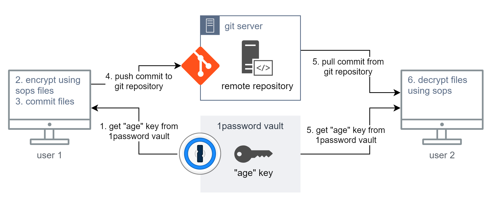

# Manage Sensitive API Keys in Public Dotfiles Using PGP and SOPS

In modern development environment, it’s common to host dotfiles
publicly—especially for sharing across machines or with the broader developer
community. However, this convenience introduces security risks, such as
accidentally exposing sensitive information like API keys, tokens, and
credentials in public repositories. API keys for services like OpenAI,
Anthropic, Google Cloud, and more, if exposed, can lead to security breaches and
unauthorized access.

<!-- more -->

Imagine pushing your meticulously crafted dotfiles to GitHub, only to realize
hours later that you've just exposed your OpenAI API key to the entire internet.
Sounds like a nightmare? Unfortunately, it's an all-too-common reality for many
developers.

The recent explosion of interest in AI development has brought a wave of
excitement - and a flood of new developers eager to experiment with powerful AI
APIs. From ChatGPT, anthropic to midjourney, flux, these tools are reshaping how
we approach software development.

But with great power comes great responsibility, and I've noticed an alarming
trend: more and more developers, especially those new to development, are
accidentally exposing their API keys and other sensitive credentials in public
repositories.

This isn't just a rookie mistake - even seasoned developers can fall into this
trap when rushing to share their latest AI project or dotfiles setup. The
consequences can be severe: unauthorized API usage, compromised accounts, and in
some cases, significant financial losses. It's this recurring issue that
compelled me to write this guide. We need a solution that's both secure and
accessible, especially for those just starting their journey in AI development.

In today's interconnected development landscape, we often find ourselves walking
a tightrope between convenience and security. We want to share our development
setups across multiple machines, collaborate with team members, and contribute
to the open-source community. But how do we do this without compromising our
sensitive data? This post delves into a bare bones solution for this pervasive
problem. We'll explore how to leverage the power of PGP encryption and Mozilla's
SOPS to create a system where your API keys, tokens, and other secrets remain
hidden, even in public repositories. By the end of this guide, you'll have a
Unix-native, cost-effective method to:

1. Securely store sensitive data in your dotfiles
2. Easily share your development setup across multiple machines
3. Maintain the convenience of public repositories without sacrificing security

Whether you're a solo developer juggling multiple AI projects or part of a team
managing shared configurations, this guide will provide you with the tools to
keep your secrets... well, secret. Let's dive in and transform those vulnerable
dotfiles into a fortress of security!

## Table of Contents

-   [Functional Requirements](#functional-requirements)
-   [Solutions Considered](#solutions-considered)
-   [Solution Blueprint](#solution-blueprint)
-   [PGP](#pgp)
-   [SOPS](#sops)
-   [Setting up SOPS with PGP](#setting-up-sops-with-pgp)
-   [Conclusion](#conclusion)
-   [TLDR](#tldr)

## Functional Requirements

Before diving into the solution, let’s outline the functional and non-functional
requirements:

-   Must work as early as `.profile` or `.bashrc`.
-   Should enable easy sharing of the same setup across multiple machines.
-   Must remain as **Unix-native** as possible (i.e., avoid desktop password
    managers or proprietary key-sharing solutions).
-   Should not introduce ongoing costs for key management.

## Solutions Considered

Here are the primary options we explored for managing sensitive data in
dotfiles:

-   **Enterprise Tools**: Solutions like HashiCorp Vault or Azure KMS offer
    robust key management but come with added complexity and cost.
    -   **Pros**: Secure, widely used, highly customizable.
    -   **Cons**: Requires maintenance, has a learning curve, and may incur
        costs for smaller teams.
-   **Password Managers or Secret Managers**: Storing secrets in managers like
    LastPass or Bitwarden is an option.
    -   **Pros**: Easy to use, available on multiple platforms.
    -   **Cons**: Not ideal for dotfiles or Unix-native environments; overkill
        for this use case.
-   **PGP + SOPS**: This is the Unix-native method we will focus on. It’s
    simple, secure, and there’s no ongoing cost. **PGP** encrypts your secrets,
    and **SOPS** manages them effortlessly.
    -   **Pros**: Cost-effective, simple, Unix-friendly.
    -   **Cons**: Requires knowledge of PGP and some configuration.

## Solution Blueprint

To manage your secrets in public dotfiles, follow these steps:

-   [ ] Install PGP (`gpg`).
-   [ ] Install Mozilla SOPS.
-   [ ] Generate a PGP key and store it securely.
-   [ ] Create a secrets file (`~/secrets.env`) outside of your git repository.
-   [ ] Use PGP and SOPS to encrypt the secrets file and commit the encrypted
        version to your dotfiles (`~/dot-files/secrets.gpg.env`).
-   [ ] Modify your `.profile` or `.bashrc` to decrypt and source the secrets
        directly into memory on startup.

Here's a diagram to visualize the solution flow:



### PGP

PGP is a powerful encryption system that uses **public-key cryptography**. In
our solution, the **client** (your machine) uses a **public key** to encrypt the
data, and the **server** (or another machine) uses a **private key** to decrypt
it.

Here’s how it works:

-   You encrypt your secrets file using your public PGP key.
-   On the machine where you need the secrets (such as a server), you decrypt
    the file using the corresponding private key.

If you’re unfamiliar with PGP’s encryption mechanism, read this simplified
explanation of
[Web of Trust](https://en.wikipedia.org/wiki/Web_of_trust#Simplified_Explanation).

### SOPS

**SOPS (Secrets OPerationS)**, created by Mozilla, is a powerful tool that makes
working with encrypted files easy. It supports PGP, AWS KMS, Google Cloud KMS,
and other encryption systems.

For our solution, we’ll use PGP with SOPS. SOPS ensures the secrets are
encrypted in place and can easily be decrypted when needed. You can either use a
**single PGP key** for all your environments or assign a unique key for each
service.

In more complex setups, you might want to look into using **AWS KMS** to manage
your keys, as it decouples key management from access credentials, which offers
a higher level of security for larger teams.

## Setting up SOPS with PGP

Let’s walk through the step-by-step process of setting up **SOPS** with **PGP**
to secure your secrets:

1. **Install PGP and SOPS**.
2. **Generate a PGP key** by running `gpg --gen-key` and configuring as follows:
    - Key type: RSA and RSA
    - Key size: 2048
    - Expiration: 0 (never expires)
    - Real name: "{{repo}} PGP"
    - Email: "{{email}}"
    - Comment: "PGP credentials for {{repo}} secrets"
3. **Create an encrypted secrets file** using SOPS:
    ```bash
    sops --pgp '{{full_fingerprint}}' secret.enc.yml
    ```
4. **Store your private key securely**, for instance, in a cloud vault or
   outside the git repository:
    ```bash
    gpg --export-secret-keys --armor {{fingerprint}} > private.rsa
    ```
5. **Modify your `.profile` to decrypt the secrets on startup**:
    ```bash
    export $(sops --decrypt ~/dot-files/secrets.gpg.env | xargs)
    ```

## Conclusion

As we've explored in this guide, managing sensitive information in public
dotfiles is not just a best practice—it's a critical component of modern secure
development, especially in the rapidly evolving world of AI and machine
learning.

By leveraging the power of PGP and SOPS, we've unlocked a robust, Unix-native
solution that allows us to:

1. Encrypt our secrets securely, ensuring they're only accessible to intended
   recipients
2. Share our development setups across multiple machines without compromising
   security
3. Contribute to open-source projects and share our dotfiles publicly with
   confidence

This approach scales well from individual developers to small and medium-sized
teams, integrating seamlessly with existing Unix-like environments. It's
particularly valuable for those working with AI APIs, where exposed credentials
can lead to significant security breaches and unexpected costs.

Remember, as you continue your journey in AI development or any field requiring
API keys and other secrets:

-   Regularly audit your public repositories for any accidentally exposed
    credentials
-   Consider implementing this PGP + SOPS solution as part of your standard
    development workflow
-   Educate your team or community about the importance of secure credential
    management

For those looking to take their security posture to the next level, consider
exploring more advanced setups supported by SOPS, such as integrating with AWS
KMS for larger-scale key management, or incorporating these practices into your
CI/CD pipelines.

Securing your secrets doesn't have to come at the cost of collaboration or
convenience. With the approach outlined in this guide, you can embrace the open,
sharing culture of the developer community while keeping your sensitive
information locked down tight.

Stay curious, keep experimenting with AI, and above all, keep your secrets
secret. Happy (and secure) coding!

Here's the steps in a single "not thoroghly tested" bash script. It should be
easy to follow and even easier to fix

## TLDR

> **⚠️ Greybeard Territory: Proceed with Caution ⚠️**
>
> For the Impatient Greybeards: The All-in-One Setup Script

> The following section contains a bash script that automates the entire setup
> process. It's for those who prefer to dive in headfirst and tweak things
> later. If you're new to this, we strongly recommend following the step-by-step
> guide above instead.
>
> Remember: With great power comes great responsibility. This script will make
> changes to your system. Review it carefully before running, and maybe pour
> yourself a strong cup of coffee first.

For those of you who scoffed at the detailed explanations and just want to get
things running, here's a bash script that sets up the entire PGP + SOPS
environment in one go. It's not thoroughly tested, so consider this a starting
point for your own customized setup.

To use this script:

1. Save it as `setup_secrets.sh`
2. Make it executable: `chmod +x setup_secrets.sh`
3. Run it: `./setup_secrets.sh`

Remember, this script is a starting point. You might need to adjust it based on
your specific environment or requirements. And as always, review any script
carefully before running it on your system.

Now, for those of you who skipped straight to this section: go back and read the
rest of the post. There's valuable context and explanations up there that will
help you understand what this script is actually doing. Don't say we didn't warn
you!

```bash title="setup_secrets.sh"
#!/bin/bash

# Function to confirm actions from the user
confirm() {
    read -r -p "${1:-Are you sure? [y/N]} " response
    case "$response" in
        [yY][eE][sS]|[yY])
            true
            ;;
        *)
            false
            ;;
    esac
}

# Install GPG (GNU Privacy Guard)
if confirm "Do you want to install GPG (GNU Privacy Guard)? [y/N]"; then
    echo "Installing GPG..."
    sudo apt-get update
    sudo apt-get install -y gnupg
else
    echo "Skipping GPG installation."
fi

# Install SOPS (Secrets OPerationS)
if confirm "Do you want to install Mozilla SOPS? [y/N]"; then
    echo "Installing SOPS..."
    wget https://github.com/mozilla/sops/releases/download/v3.7.3/sops-v3.7.3.linux -O sops
    chmod +x sops
    sudo mv sops /usr/local/bin/
else
    echo "Skipping SOPS installation."
fi

# Remove SOPS default PGP keys
if confirm "Do you want to remove any default SOPS PGP keys? [y/N]"; then
    echo "Listing GPG keys..."
    gpg --list-keys
    echo "Enter the fingerprint of the key you want to delete (or press Enter to skip):"
    read -r fingerprint
    if [ -n "$fingerprint" ]; then
        echo "Deleting key with fingerprint $fingerprint..."
        gpg --delete-keys "$fingerprint"
        gpg --delete-secret-keys "$fingerprint"
    else
        echo "No keys deleted."
    fi
else
    echo "Skipping sops default key deletion."
fi
# Generate a GPG key
if confirm "Do you want to generate a new GPG key for encrypting secrets? [y/N]"; then
    echo "Generating GPG key..."
    gpg --gen-key
else
    echo "Skipping GPG key generation."
fi

# Create the secrets.env file
if confirm "Do you want to create a new secrets.env file at ~/secrets.env? [y/N]"; then
    echo "Creating a new secrets.env file at ~/secrets.env..."
    cat <<EOL > ~/secrets.env
# Add your secrets here in KEY=VALUE format
API_KEY=your_api_key_here
SECRET_KEY=your_secret_key_here
EOL
    echo "Created secrets.env. Please add your sensitive data."
else
    echo "Skipping secrets.env creation."
fi

# List available GPG keys and their fingerprints
echo "Encrypting your ~/secrets.env"
echo "Select Available GPG keys:"
gpg --list-keys --fingerprint

# Ask the user to select a GPG key fingerprint
echo "Enter the fingerprint of the GPG key you want to use for encryption:"
read -r fingerprint

# Check if the user input is empty
if [ -z "$fingerprint" ]; then
    echo "No fingerprint provided. Aborting encryption."
    exit 1
fi

# Encrypt the secrets.env file using the selected fingerprint and save it as secrets.gpg.env
if [ -f ~/secrets.env ]; then
    echo "Encrypting secrets.env into secrets.gpg.env..."
    sops --encrypt --pgp "$fingerprint" ~/secrets.env > ~/secrets.gpg.env
    echo "Encryption complete. Encrypted file saved as ~/secrets.gpg.env"
else
    echo "secrets.env not found in home directory. Please create it first."
    exit 1
fi

echo "Setup complete!"

```

---

## Footnotes

1. PGP vs. SSH Encryption:
   [Link to Wikipedia](https://en.wikipedia.org/wiki/Web_of_trust#Simplified_Explanation)
2. SOPS GitHub Repo:
   [SOPS on GitHub](https://github.com/mozilla/sops/tree/0494bc41911bc6e050ddd8a5da2bbb071a79a5b7#up-and-running-in-60-seconds)
3. Here's a great info-graphic of all the ways sops can be used by the good
   folks at GitGuardian
    1. [Infographic](https://www.gitguardian.com/files/securityzines-sops?ref=blog.gitguardian.com)
    2. [Blog post](https://blog.gitguardian.com/a-comprehensive-guide-to-sops/)

---

<!-- # Public Dot-files with Private Secrets

<!-- WRITING INSTRUCTION -->
<!-- - First - study the comments, instructions thoroghly atleast three times. This is important. -->
<!-- - Research the links provided with the context given for why the link was included.  Use tools to get webpages or youtube transcripts always. -->
<!-- - Reason about a high level narrative structure and flow for the blog.  We have included the title and the footnotes.  Everything else needs to be fleshed out. -->
<!-- - Start by writing a Table of Content. Use H2 and h3 only.  We don't want too many levels of nesting. -->
<!-- - Review if the Table of content flows well. Titles need to be short to medium, and don't make them boring.  A bit of wit is good to have but don't try too hard. -->
<!-- - Start writing the sections one at a time. Write, review the section,  check if the section flows well from the previous section. Follow the following directions for writing sections -->
<!--    - Introductions shouldn't be too long.  Explain why you are writing this, tell the person why its important, how you've laid out the blog and whats in it for the reader. You need to have the first paragraph engaging and something which hooks a reader and keeps them from bouncing off the page. -->
<!--    - Each section should use proper emphasis like bold/italics, urls,  and footnotes where appropriate. -->
<!--    - If something can be represented concisely in ordered or unordered lists, please do so. -->
<!--    - Use code snippets for technical topics. This isn't necessary, use wisely. For programming topics do use code examples. -->
<!--    - In between sections  you can use markdown comments to write down rough notes about what you intend to add in those sections. This will guide you in getting feedback from me, as well as save us iterations when we go into the whole content writing. -->

<!-- BLOG DESCRIPTION -->

<!-- We want to write an instructional blog about how we can manage sensitive data like API keys in our publicly hosted dotfiles. -->

<!-- Problem should talk about why this is important,  simply explain the security risk but dont preach too much. our readers aren't dumb. -->
<!-- -   Openai keys, anthropic keys, whole bunch of other knick knacks. -->
<!-- -   Google credentials json file. -->
<!-- -   Can't litter them in public dotfiles -->

<!-- ## Functional Requirements -->

<!-- NOTE: Requirements of our solution  both functional and non functional.  Keep this to the point and in bullet points. -->
<!-- -   Can work as early as .profile and .bashrc. -->
<!-- -   Should be able to share the same setup across machines. -->
<!-- -   As unixy as possible. This isn't supposed to solve for desktop password -->
<!--     management and key sharing. -->

<!-- ## Solutions Considered -->

<!-- <!-- -->
<!-- Options or Solution Space -->
<!-- Explain what each solution is in 1 small para.  then have a list of upto 3 pros and 3 cons. -->
<!-- -   Big guns - Hashcorp vault, Azure KMS, yada yada. -->
<!-- -   Some form of password / secret manager. -->
<!-- -   Good old pgp? + something. -->

<!-- We conclue we want to use simple pgp + sops. Unix way of doing things. easy to reason about, no running cost. encryption at rest. -->

<!-- ## Solution Blueprint -->

<!-- <!-- NOTE -->
<!-- I have laid out the solution steps.  covert this into a markdown checklist which people can visually follow. -->
<!-- Also add a mermaid diagram which shows how each component of the solution works -->

<!-- -   Install pgp -->
<!-- -   Install mozilla sops -->
<!-- -   Generate a pgp key. side channel it to a secure cloud vault. or into a -->
<!--     separate non-git folder on your pc. -->
<!-- -   create a secrets file ~/secrets.env OUTSIDE the git repo. -->
<!-- -   Use this pgp key to Sops encrypt files in place and commit it in -->
<!--     ~/dot-files/secrets.gpg.env -->
<!-- -   Commit the files to github. Just a bunch of mubled mess with some structure. -->
<!-- -   ~/.profile will use the key + sops to decrypt the file and immediately -->
<!--     source it with a pipe. No temp files, no disk writing. straigt to process -->
<!--     memory. depending on how the .env file was you may have to do some bash -->
<!--     magic to load it properly -->
<!--     -   `export $(cat ~/ai-keys.env | xargs) ` -->
<!-- -   Profit. Lets get into the hairy details -->

<!-- # PGP -->

<!-- It’s security mechanism is that we (i.e. client) use a PUBLIC key from the -->
<!-- receiver (i.e. server) and encode it with a random key (I’m saying nonce but it -->
<!-- could be reused) -->

<!-- This varies from RSA and SSH because the server uses a PUBLIC key to identify -->
<!-- the client. -->

<!-- This means the recipient will initially decrypt via our (i.e. client’s) public -->
<!-- key (verifying the source) and then decrypting via their (i.e. server’s) private -->
<!-- key to get the data. -->

<!-- To reiterate, the data we send is twice encrypted source’s private key outer -->
<!-- shell, recipient’s public key inner shell. -->

<!-- https://en.wikipedia.org/wiki/Web_of_trust#Simplified_Explanation -->

<!-- # SOPS -->

<!-- <!-- -->
<!-- For a PGP setup, development machine must have the same public/private PGP key. -->
<!-- Technically, we only need the public key to write content but for -->
<!-- reading/editing we need the private key. -->

<!-- The production server will have the private key for decryption. -->

<!-- We can share the same PGP key for all services or make it per-service (obviously -->
<!-- 1 is easier to maintain). -->

<!-- As an alternative to this sensitive setup, we can use AWS’ KMS which will manage -->
<!-- these public/private keys for us. To access said keys, we can use AWS -->
<!-- credentials and their access control policy. -->

<!-- The benefit of using KMS is it decouples the encryption key from access -->
<!-- credentials. Great job by Mozilla here :100: -->

<!-- # Setting up SOPS with PGP -->

<!-- First, get SOPS installed by following its instructions: -->

<!-- https://github.com/mozilla/sops/tree/0494bc41911bc6e050ddd8a5da2bbb071a79a5b7#up-and-running-in-60-seconds -->

<!-- To delete their PGP key (although you likely don’t need to; GPG is more of a -->
<!-- credential manager): -->

<!-- -   List installed keys via `gpg --list-keys` -->

<!-- ``` -->
<!-- /home/todd/.gnupg/pubring.gpg -->
<!-- ----------------------------- -->
<!-- pub   1024R/07FB1A0A 2015-10-08 -->
<!-- uid                  SOPS Functional Tests (https://github.com/mozilla/sops/) <ulfr+sopstests@mozilla.com> -->
<!-- sub   1024R/7CD79CC0 2015-10-08 -->
<!-- ``` -->

<!-- -   Delete desired key via `gpg --delete-keys {{fingerprint}}` and -->
<!--     `gpg --delete-secret-keys {{fingerprint}}` -->
<!--     -   In the example above, public fingerprint is `07FB1A0A` and private is -->
<!--         `7CD79CC0` -->
<!-- -   Verify empty files at `~/.gnupg/pubring.gpg` and `~/.gnupg/secring.gpg` -->

<!-- GPG cheatsheet here: http://irtfweb.ifa.hawaii.edu/~lockhart/gpg/gpg-cs.html -->

<!-- Now that we have SOPS installed, let’s set it up in our repo: -->

<!-- 1. Generate a GPG key for the repo -->
<!--     1. Use `gpg --gen-key`. For configuration, I chose: -->
<!--         1. Key type: RSA and RSA -->
<!--         2. Keysize: 2048 -->
<!--         3. Expiration: 0 (never expires, otherwise we will have to re-set up -->
<!--            configs) -->
<!--         4. Real name: {{repo}} PGP (e.g. “twolfson.com PGP”) -->
<!--         5. Email address: {{email}} -->
<!--         6. Comment: PGP credentials for {{repo}} secrets -->
<!--         7. Password: Empty password -->
<!--             - You may use a password but all developers and scripts performing -->
<!--               decryption will need to know that password -->
<!--             - This effectively makes the password useless since we are more -->
<!--               concerned about compromising our secrets than the RSA key -->
<!-- 2. Find full fingerprint for keys via `gpg --fingerprint` -->
<!--     - This will be `740D DBFA...` in `Key fingerprint = 740D DBFA...` -->
<!-- 3. Create our file via `sops --pgp '{{full_fingerprint}}' secret.enc.yml` -->
<!--     - For JSON, we can use a non-YAML extension -->
<!--     - For future edits of the file, we can use `sops secret.enc.yml` (our PGP -->
<!--       fingerprint has been stored inside of the file) -->
<!-- 4. Extract private key to file via -->
<!--    `gpg --export-secret-keys --armor {{fingerprint}} > private.rsa` -->
<!--     - `--armor` exports a human-friendly ASCII format instead of binary -->
<!-- 5. Upload private key to our server via -->
<!--    `rsync private.rsa {{server}}:private.rsa` -->
<!-- 6. SSH onto our machine -->
<!-- 7. Import private key into `gpg` keychain via `gpg --import private.rsa` -->
<!-- 8. During deployment, decrypt `secret.enc.yml` to its plaintext variant via -->
<!--    `sops --decrypt secret.enc.yml > secret.yml` -->
<!-- 9. Run server using plaintext `secret.yml` -->

<!-- ## Conclusion -->

<!-- While we have laid out a solution using gpg, sops supports a lot more key -->
<!-- management systems. You can easily scale it to be used in small to medium sized -->
<!-- organizations while keeping the workflow almost similar. The only difference -->
<!-- comes in how we provide sops with its signing/unsigning keys.   -->
<!-- Sops also works well with k8s and the cncf tool chain in general so if you are -->
<!-- revamping your devsecops definitely dig deeper into sops or reach out to an -->
<!-- expert and get things done properly at the get go. -->
