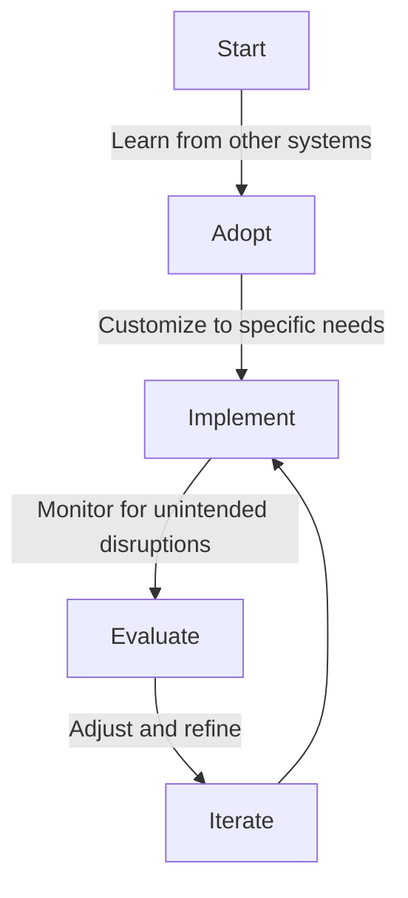

# Navigating the Consultant Trap in Startup World

## Table of Contents
- [Introduction](#introduction)
- [The Allure of Consultants](#the-allure-of-consultants)
- [Challenges with Standardized Solutions](#challenges-with-standardized-solutions)
- [The First Principles Approach](#the-first-principles-approach)
- [Conclusion](#conclusion)

## Introduction 

Today, I want to discuss a common pitfall for startups—what I like to call the "consultant trap." As startups strive for operational efficiency and profitability, they often seek guidance from consulting firms, but this approach may not always lead to the desired outcomes.

## The Allure of Consultants 

Startups frequently believe that consultants hold the key to solving their problems and providing direction. However, while consulting firms can offer valuable insights, their primary focus is often on maximizing their own revenue, which may not align with the startup's goals.

### Nvidia CEO's Insight

In a notable interview, the CEO of Nvidia highlighted the fallacy of assuming that one-size-fits-all solutions apply to every company. Each business operates differently, with unique structures, needs, and products. What works for one company may not work for another.

## Challenges with Standardized Solutions 

Consulting firms often propose standardized solutions, such as implementing predefined organizational structures or agile frameworks like SAFe. While these solutions may seem appealing, they can result in a "cookie-cutter" approach that fails to address the specific requirements of the startup.

### Case Studies

Various business case studies underscore the importance of customization. For instance, the failure of Enron, once considered a model of efficiency, demonstrated the dangers of adhering rigidly to a standardized approach without considering the company's unique context.

## The First Principles Approach 

Instead of relying solely on consultants and their standardized solutions, startups should embrace a first principles approach. This involves learning from existing systems but tailoring strategies to fit individual use cases, ensuring a more organic and effective implementation.

### Mermaid Diagram Example

## Conclusion 

In conclusion, startups must be cautious when engaging with consultants and avoid falling into the consultant trap. By adopting a first principles approach and customizing solutions to their unique needs, startups can navigate challenges more effectively and achieve sustainable growth.

Remember, learning from others' experiences is valuable, but adapting those lessons to your own situation is key. Feel free to reach out to me on Twitter [@wiresurfer](https://twitter.com/wiresurfer) if you have any questions or need further guidance. Let's build a startup ecosystem grounded in thoughtful, personalized strategies. Thank you for listening.

